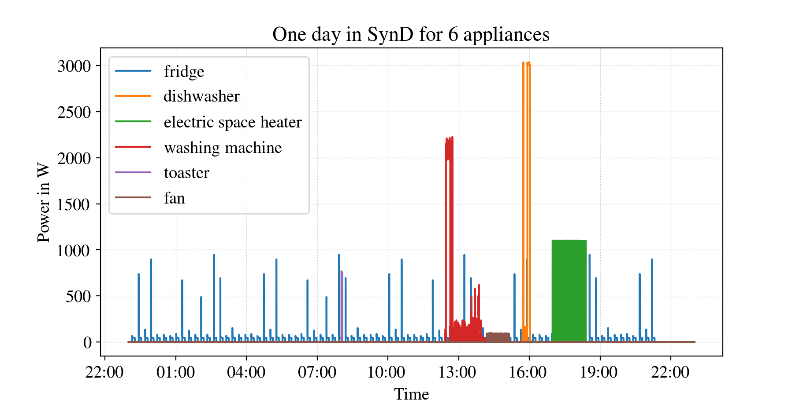

# A Synthetic Energy Consumption Dataset for NILM

With the roll-out of smart meters, the importance of effective non-intrusive load monitoring (NILM) techniques has risen rapidly. NILM
estimates the power consumption of individual devices given their aggregate consumption. In this way, the combined consumption must only be
monitored at a single, central point in the household, providing various
advantages such as reduced cost for metering equipment.

As related Machine Learning problems, research and development requires a sufficient amount of data to train and validate new approaches. As a viable alternative to collecting datasets in buildings during expensive and time-consuming measurement campaigns, the idea of generating synthetic datasets for NILM gain momentum recently.

| Aspect       |   Fact about SynD        |
| ------------- |:-------------:|
| Number of Appliances      | 21 |
| Duration     | 180      |  
| Sampling Rate | 5 Hz    |
| Scope | residential NILM   |
| Compatible to NILMTK? |  Yes   |
| Is SynD public? | [Download SynD here.](https://docs.google.com/forms/d/e/1FAIpQLSeDYgj1ljwLb65WEhpcygzvjm2NQo4fWZ5z9tTB_RjZHqHVwQ/viewform?usp=sf_link)|

With SynD, we introduce a synthetic energy dataset with focus on residential buildings. We release 180 days of synthetic power data on aggregate level (i.e. mains) and individual appliances. SynD is the result of a custom simulation process that relies on power traces of real household appliances.



## Usage Notes

We provide supplemental material for new NILMTK users. Please report any bugs in the provided material or the dataset!

* [Exploring SynD with NILMTK](examples/synd_exploration.ipynb)

* [Simple Disaggregation Example using NILMTK](examples/simple_disaggregation.ipynb)

* More notes are about to follow!

Please be so kind as to cite our paper in case you're using SynD for research:

```
@article{klemenjak2020synd,
  title={},
  author={},
  journal={},
  volume={},
  pages={},
  year={},
  publisher={}
}
```

## Stay updated!

* Follow Christoph Klemenjak on [Twitter](https://twitter.com/CKlemenjak) or read latest [Blog Posts](https://klemenjak.github.io/)
* Follow Wilfried Elmenreich on [Twitter](https://twitter.com/elmenreich) or connect via [LinkedIn](https://www.linkedin.com/in/wilfriedelmenreich/)

## History

* October 2019: Repository goes live!

## Licence

We release all content associated with this repository under the licence [Attribution 4.0 International](https://creativecommons.org/licenses/by/4.0/) (CC BY 4.0).
